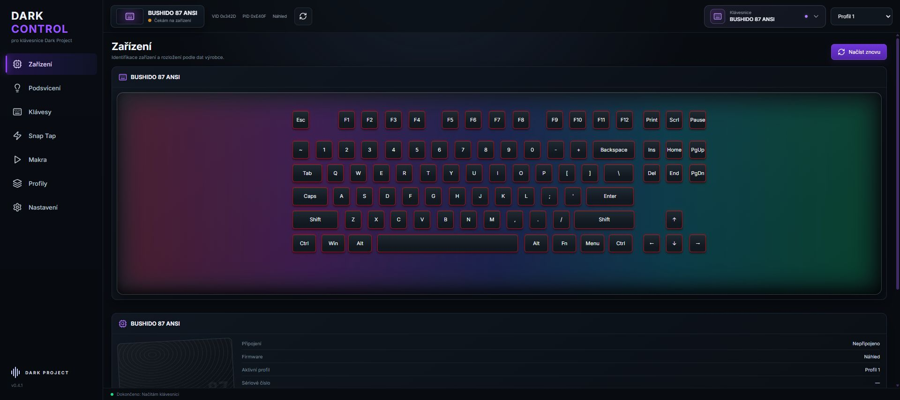
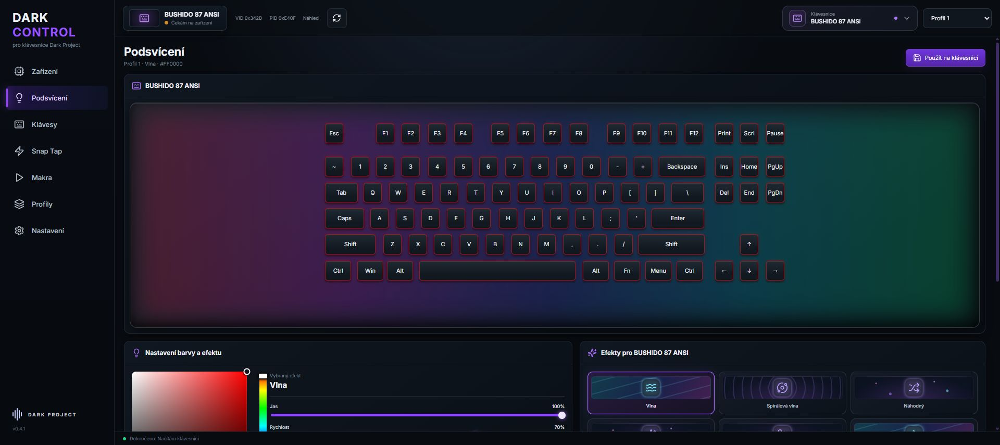
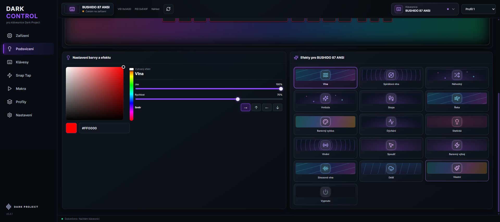
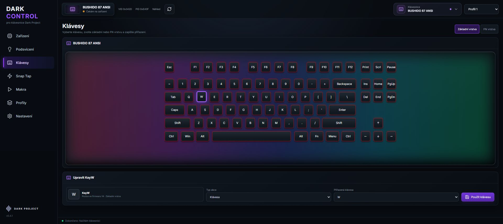
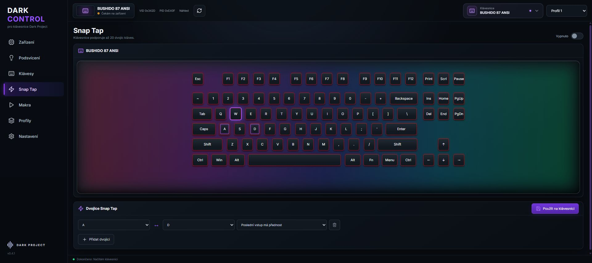
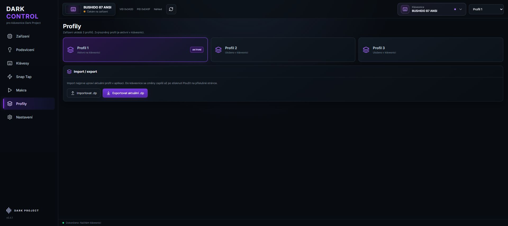
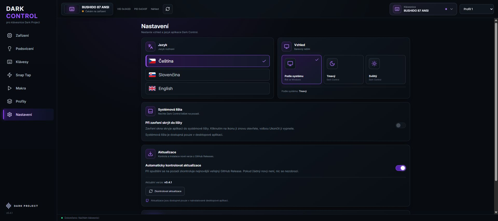
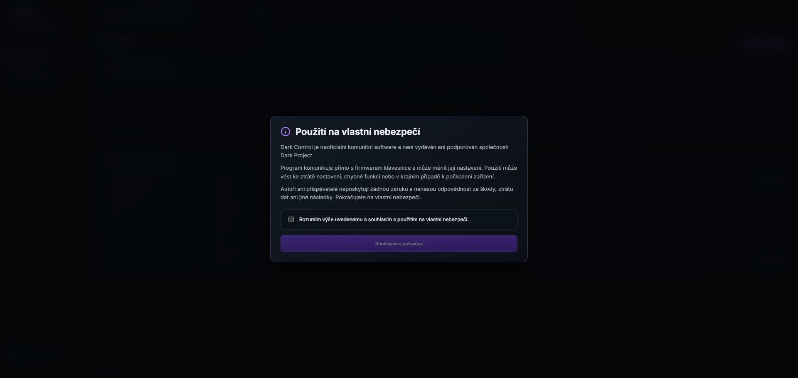
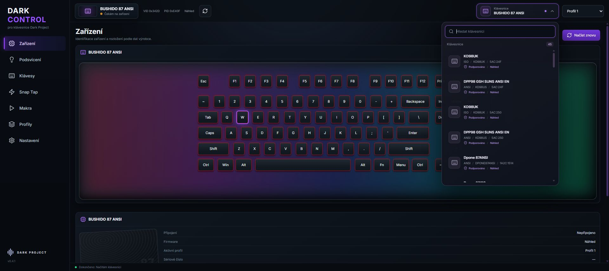

# Dark Control v0.4.1 — galerie

Skutečné screenshoty českého rozhraní aplikace. Pořízeno v prohlížečovém režimu náhledu s výchozími daty výrobce pro BUSHIDO 87 ANSI, bez připojené fyzické klávesnice. Nejde o generované návrhy ani o záznam komunikace přes HID. Funkce systémové lišty a aktualizací jsou dostupné v desktopové aplikaci.

Pro představení v hlavním README doporučujeme podsvícení, mapování kláves a nastavení. Z kořenového README lze obrázky vložit například takto:

```markdown

```

## Zařízení a rozložení klávesnice



## Podsvícení



## RGB efekty a nastavení barvy



## Mapování kláves



## Snap Tap



## Profily a import / export



## Nastavení



## První spuštění



## Výběr klávesnic


